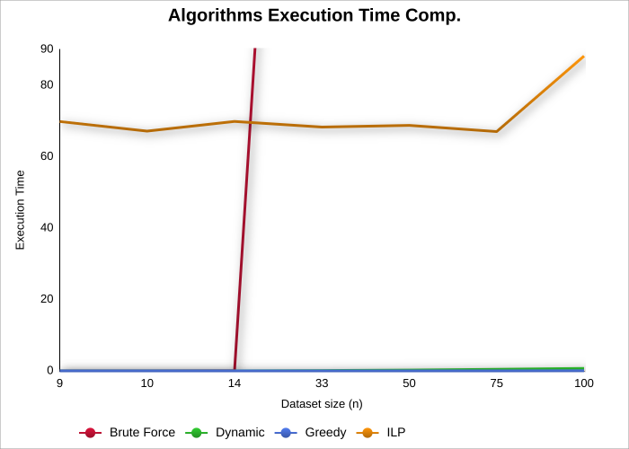
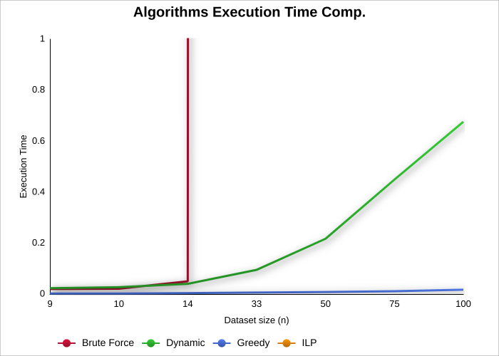

## DA Second Group Project
This project is designed to solve the Delivery Truck Pallet Packing Optimization Problem, a real-world version of the 0/1 Knapsack Problem.
For that some algorithms were implemented (brute force, dynamic programming, approximation and ilp) to maximize profit under weight constraints and compare different efficiencies and performances.
In addition, we developed graphical representations of the different times and space obtained.
[ Doxygen index file](./docs/html/index.html)

## Tech Used

- CLion (JetBrains)
  -> main modeling and design
- Doxygen
  -> Documentation generations
  -> Comments organization

## Members

- Catarina Loureiro de Bastos (up202307631)
- Nuno Filipe Nunes Costa (up202305503)
- Vasco Miguel Fidalgo Martins Gonçalves (up202305513)

## Performance Evaluation

Taking a closer look to the execution time of each algorithm (measured using the chrono lib) there can be taken some conclusions:

- Brute-Force algorithm has a good efficiency with small data-sets similar to the dynamic approach. But has the size increases so does it's execution time, by a lot (because of the **O(2^n)** time complexity).
- Dynamic Programming Approach starts with a similar efficiency has brute-force for small datasets. But being that it's complexity is of **O(n * W)** being that it checks every cell of a matrix n x W it has a moderate increase with the dataset size.
- Greedy Approach always has a good performance being that it's time complexity bases on the sorting part of the problem (sorting by v/w), taking a time complexity of **O(n log(n))**. The downside is that it's not reliable and the solution can be suboptimal.
- ILP Approach has as **worst case O(2^n)** but, using branch and bound techniques this only happens when it has to search the whole tree. In the normal case, it has a moderate growth with the dataset size, and can be a reliable algorithm for large datasets, but at the same time take an extremelly long time.

In terms of space complexity, we can also evaluate the algorithms:

- Brute-Force algorithm has O(n) due to recursion depth and the subset storage.
- Dynamic Programming Approach has as space complexity O(n * W) because it stores a 2D table with dimensions proportional to the number of items n and the capacity W (full_weight).
- Greedy Approach has O(n) since it stores a copy of the input vector for sorting and a result vector holding selected pallets.
- ILP Approach uses roughly O(n * W) space, mainly due to storing the constraint matrix based on the number of items and knapsack capacity.

Finally, in terms of accuracy, here is a clear comparison between the algorithms:

- Brute Force and Dynamic Programming Approach guarantee optimal solutions, so their accuracy is 100%, because they explore all or enough possibilities to find the best answer.
- Greedy and ILP Approach are faster but not always optimal since it selects items based on the best profit-to-weight ratio and may miss combinations that yield a higher total profit. Its accuracy depends on the problem instance but generally provides a good approximation that can be close to optimal, though never guaranteed.

## ILP APPROACH

From a certain point of view it can be taken an ILP aproach to the 0/1 Knapsack Problem.

- Objective is to **Maximize sum of x[i]*v[i]**, for every i ∈ Objects and v[i] it's value.
- To track what items are included x[i] has the value **i if included** and **0 if not included**.
- The problem is that the sum of the weights can't be > than the max capacity of the knapsack (W). It is added the constraint that for every i ∈ Objects and w[i] it's weight, the sum of **x[i]w[i] <= W**

This aproach is taken into account in the python program in ./ILP_SOLVER folder that runs with the help of the ilp_utils class.

Maximize: ∑(v[i]x[i])
Constraint: ∑(w[i]x[i]) ≤ W

## GREEDY APROACH

Greedy aproach, although having an excelent execution time it falls short of the mark in exactness.

- Dataset nº1 -> Greedy: 29 / Optimal: 32

The greedy aproach is an aproximation algorithm, it gives a good time complexity at the cost of the change of having a suboptimal result. 
For large datasets and a large limit capacity (W) this error can be almost minimal so the greedy aproach can be taken into consideration. A margin of 3 when the result was 32 is more significant than a margin of 3 when the result was 698 (Dataset nº 5 custom)
